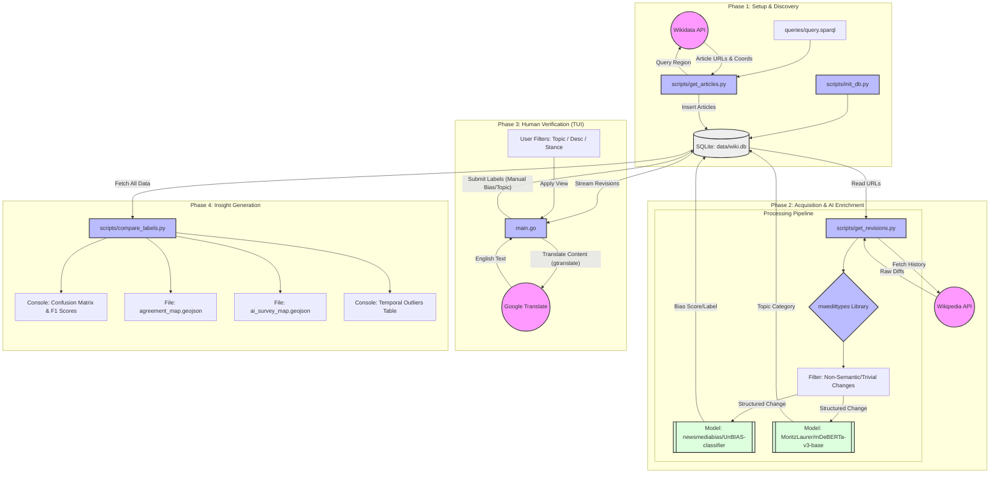
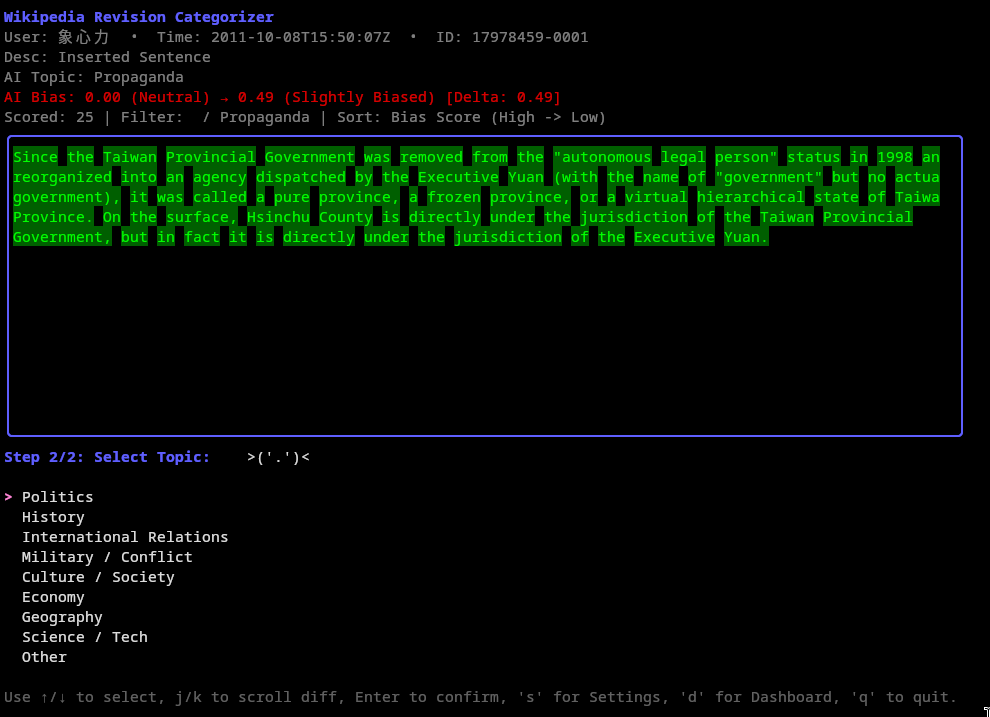
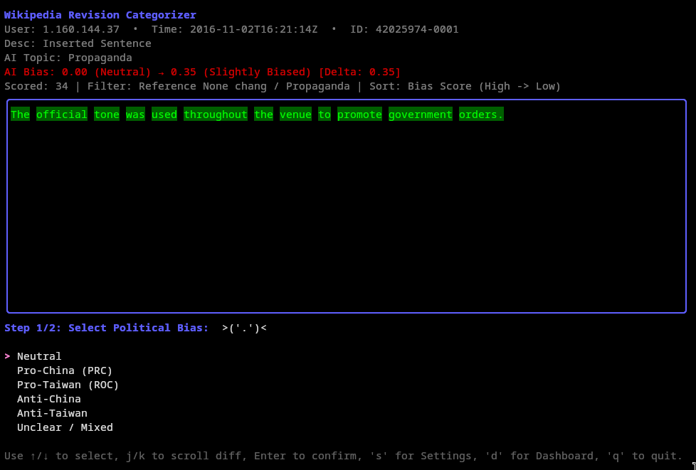
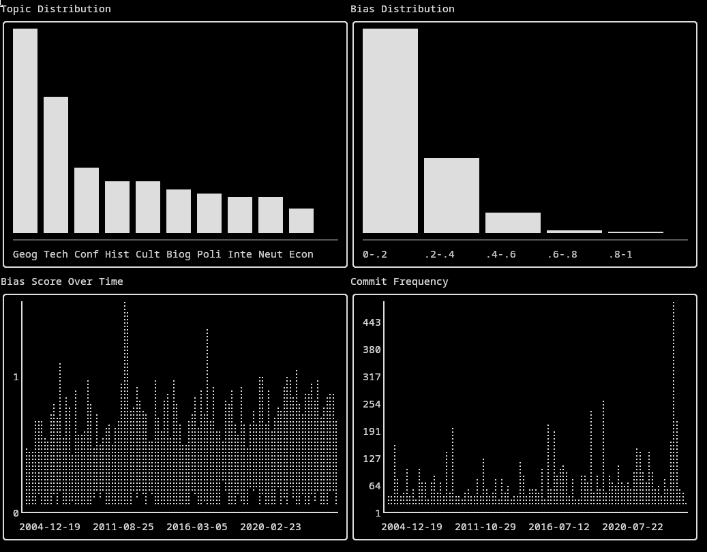
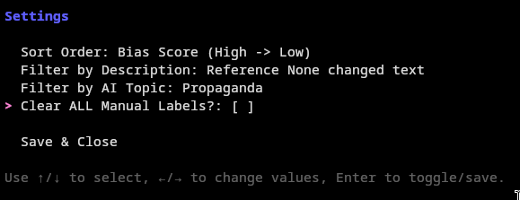

# Wikipedia Semantic Revision Analyzer & Categorizer

A hybrid Python/Go application that analyzes Wikipedia revision histories for semantic changes, political bias, and topic categorization using AI models. It features a terminal-based user interface (TUI) for manual review and a real-time dashboard for visualizing trends.



## Features

*   **Revision Fetching**: Automatically retrieves revision histories from Wikipedia articles.
*   **Semantic Analysis**: Uses NLP models (Hugging Face Transformers) to detect:
    *   **Political Bias**: Classifies changes as Neutral, Slightly Biased, or Highly Biased.
    *   **Topic Categorization**: Classifies revisions into topics like Politics, Science, Culture, etc.
    *   **Semantic Diff & Change Classification**: Uses the `mwedittypes` library to parse raw wikitext diffs into structured changes. This allows the system to identify specific edit types (e.g., "Inserted Sentence", "Template change") and generate human-readable descriptions for each change, while filtering out trivial noise.
*   **Interactive TUI (Go)**:
    *   Review revisions one-by-one.
    *   **Automatic Translation**: Automatically translates revision content to English for easier review.
    *   Manually validate or correct AI classifications.
    *   Filter revisions by topic or description.
    *   **Live Dashboard**: Visualize topic distribution, bias trends, and commit frequency over time.
*   **Data Persistence**: Stores all data in a local SQLite database.

## Prerequisites

*   **Go** (1.21+)
*   **Python** (3.9+)
*   **SQLite3**

## Installation

### 1. Clone the Repository
```bash
git clone <repository-url>
cd <repository-directory>
```

### 2. Python Setup (Backend/Analysis)
Create a virtual environment and install the package in editable mode. This installs the `app` command.

```bash
python3 -m venv .venv
source .venv/bin/activate
pip install .
```

### 3. Go Setup (TUI)
Install the Go dependencies and build the application.

```bash
go mod tidy
go build -o wiki-analyzer .
```

## Usage

### Step 1: Initialize Database
Set up the SQLite database schema.

```bash
app init-db
```

### Step 2: Fetch Articles (Optional)
Populate the database with a list of articles to track (if not already seeded). This step uses the SPARQL query defined in `queries/query.sparql`.

```bash
app fetch-articles
```

### Step 3: Fetch & Analyze Revisions
Run the main ingestion script to download revisions and perform AI analysis. This process can be long-running.

```bash
app revision-fetch-translated
# Optional: Run with debug output
app revision-fetch-translated --debug
```

### Step 4: Run the TUI
Launch the interactive terminal application to review data and view the dashboard.

```bash
./wiki-analyzer
```

**TUI Controls:**
*   `↑/↓`: Navigate menus.
*   `Enter`: Select an option or confirm a classification.
*   `s`: Open **Settings** (Filter by topic/description, change sort order).
*   `d`: Open **Dashboard** (View analytics charts).
*   `q`: Quit.

### Step 5: Analyze Label Agreement & Trends
Generate a comprehensive report that includes:
1.  **Human vs AI Agreement**: Confusion Matrices, Precision/Recall/F1-scores, and Distribution Bias analysis.
2.  **AI Survey**: Analysis of unlabeled data to identify dominant topics and stances across the dataset.
3.  **Temporal Outliers**: Detection of months with anomalous revision activity or bias scores.

This command exports two GeoJSON files:
*   `agreement_map.geojson`: Visualizes agreement rates per article.
*   `ai_survey_map.geojson`: Visualizes AI-detected dominant topics and stances for all articles.

```bash
app compare-labels
```

## Interface & Workflow

### 1. Revision Review (Main Interface)




The main review screen provides a comprehensive view of each analyzed revision:

*   **Live Translation**: The diff content is automatically translated to English (via Google Translate) to facilitate the review of foreign-language edits.
*   **Metadata**: Displays the **Revision ID**, **Timestamp**, and the **User** (either a registered username or an IP address).
*   **Change Description**: A concise description of the edit (e.g., "Inserted Sentence", "Template change"), generated by the **`mwedittypes`** library. This part of the pipeline parses the raw wikitext diffs to identify the structural nature of the change, separating meaningful content edits from formatting or template adjustments.
*   **AI Analysis**: (Both AI Topic and AI Political Stance are predicted based on the 'after_text' of a revision; if 'after_text' is empty, 'before_text' is used as a fallback for analysis.)
    *   **AI Topic**: The topic predicted by the zero-shot classification model.
    *   **AI Bias**: The bias score and label (Neutral, Slightly Biased, Highly Biased) assigned by the UnBIAS classifier.
    *   **AI Political Stance**: The political stance (e.g., Pro-China, Pro-Taiwan) predicted by the zero-shot classification model using `data/political_categories.json`.
*   **Score**: A counter showing the total number of revisions that have been manually labeled and saved to the database.
*   **Filter & Sort**: Indicates the currently active filters (by Topic or Description) and the sort order (e.g., Bias Score High → Low).

**Manual Labeling Process**:
The app employs a two-step "Human-in-the-Loop" verification process:
1.  **Select Bias**: First, you confirm or correct the political bias label for the change.
2.  **Select Topic**: Next, you confirm or correct the topical category.

### 2. Dashboard



The live dashboard provides real-time analytics of the processed data, visualizing topic distributions, bias trends, and commit activity over time.

### 3. Settings



The settings menu allows you to dynamically filter the revision queue by specific AI Topics (pulled from the database) or Change Descriptions, and adjust the sorting criteria to focus on the most relevant edits.

## Project Structure

*   `main.go` & `dashboard.go`: The Go-based TUI application.
*   `main.py`: Entry point for the Python `app` CLI.
*   `scripts/`: Python scripts for data ingestion and analysis.
    *   `get_revisions.py`: Core logic for fetching Wikipedia data and running AI models.
    *   `init_db.py`: Database schema setup.
*   `data/`: Stores the SQLite database (`wiki.db`) and configuration JSONs.
*   `queries/`: SPARQL queries used for fetching article lists.

## Customization & AI Models

### Modifying the Article Scope (SPARQL)
The file `queries/query.sparql` determines which Wikipedia articles are fetched for analysis. It currently uses Wikidata SPARQL to find articles related to specific geographic or administrative regions.

To adapt this for a different area of study:
1.  Open `queries/query.sparql`.
2.  Locate the Wikidata IDs currently used: **`wd:Q74054` (Hsinchu County)** and **`wd:Q249994` (Hsinchu City)**.
3.  Replace these IDs with the Wikidata entity ID of your target region (e.g., `wd:Q60` for New York City, `wd:Q145` for United Kingdom).
4.  Run `app fetch-articles` again to populate the database with the new set of articles.

### AI Models Used
This application leverages two specialized Hugging Face Transformer models:

1.  **Bias Detection**: `newsmediabias/UnBIAS-classifier`
    *   **Type**: Text Classification (Sequence Classification).
    *   **Why**: Trained specifically on news media to detect bias, making it suitable for identifying non-neutral point-of-view (NPOV) violations in Wikipedia edits. It classifies text as Neutral, Slightly Biased, or Highly Biased.

2.  **Topic Classification**: `MoritzLaurer/mDeBERTa-v3-base-mnli-xnli`
    *   **Type**: Zero-Shot Classification.
    *   **Why**: This model is capable of classifying text into arbitrary categories without specific training on those categories. It is multilingual (supporting 100+ languages), which is crucial for analyzing Wikipedia edits in different languages (like Chinese and English in the default query). It categorizes edits into the topics defined in `data/topic_categories.json` (e.g., Politics, Economy, History).

### Building a Fine-Tuning Dataset
While the zero-shot models provide a strong baseline, they are general-purpose. This application is designed to act as a **Human-in-the-Loop (HITL)** annotation tool to create a high-quality, domain-specific dataset.

1.  **Ingest**: The AI models provide initial "weak labels" (predictions).
2.  **Review**: You use the TUI to manually verify or correct these labels based on the categories in `data/political_categories.json` and `data/topic_categories.json`.
3.  **Train**: Once you have reviewed a sufficient number of revisions, the `revisions` table in `wiki.db` will contain pairs of *Text Diff* → *Validated Label*.
4.  **Export**: You can query the database to export this labeled data (where `manual_bias` IS NOT NULL) to fine-tune a smaller, more efficient, or more accurate model specifically for your research domain.

## Tech Stack

*   **Backend**: Python, PyTorch, Hugging Face Transformers (`newsmediabias/UnBIAS-classifier`, `MoritzLaurer/mDeBERTa-v3-base-mnli-xnli`).
*   **Frontend (TUI)**: Go, Bubble Tea, Lipgloss, ntcharts.
*   **Database**: SQLite.
